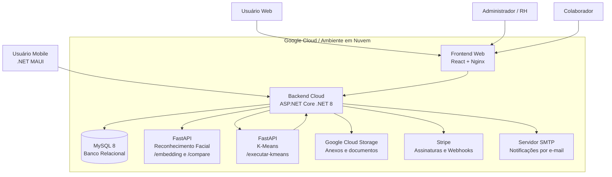

# DeltaFour - Ponto!

**Fatec Jahu | Graduação em Desenvolvimento de Software Multiplataforma**

Sistema de ponto eletrônico inteligente com validação por reconhecimento facial, geolocalização, controle de jornada, gestão de colaboradores, geração de folha de ponto em PDF e integração com assinatura via Stripe.

---

## Link do Repositório

* **Repositório principal:** [DeltaFour/Ponto-IA](https://github.com/DeltaFour/Ponto-IA)
* **Organização do projeto:** [DeltaFour](https://github.com/orgs/DeltaFour/repositories)

### Repositórios do ecossistema

* [BACKEND](https://github.com/DeltaFour/BACKEND)
* [FRONTEND](https://github.com/DeltaFour/FRONTEND)
* [Api-Kmeans](https://github.com/DeltaFour/Api-Kmeans)
* [face-recognition-api](https://github.com/DeltaFour/face-recognition-api)

---

## Identificação do Grupo

| Integrante           | GitHub                                               |
| -------------------- | ---------------------------------------------------- |
| Rafael Paschoalotti  | [@Rafael7121](https://github.com/Rafael7121)         |
| Otavio Martins Ficho | [@TavossX](https://github.com/TavossX)               |
| Gabriel Costal Fogo  | [@GabrielFogo](https://github.com/GabrielFogo)       |
| Arthur Servidor      | [@ArthurServidor](https://github.com/ArthurServidor) |

---

## Sobre o Projeto

O **DeltaFour - Ponto!** é uma plataforma para controle de ponto eletrônico voltada a empresas que precisam registrar, acompanhar e validar a jornada de trabalho dos colaboradores.

A solução contempla diferentes perfis de acesso, como **SUPER_ADMIN**, **ADMIN**, **RH** e **EMPLOYEE**, permitindo que cada usuário utilize funcionalidades específicas conforme suas permissões.

Entre as principais funcionalidades estão:

* Login e controle de sessão com autenticação JWT;
* Cadastro e gerenciamento de empresas;
* Cadastro e gerenciamento de colaboradores;
* Cadastro de turnos de trabalho;
* Registro de ponto com validação por geolocalização;
* Registro de ponto com reconhecimento facial;
* Registro de ponto em atraso com justificativa e anexo;
* Validação de pontos em atraso pelo RH;
* Geração e assinatura de folha de ponto em PDF;
* Dashboard web com informações gerenciais;
* Aplicativo mobile para registro de ponto;
* Integração com Stripe para assinaturas;
* Serviço de análise de pontualidade com K-Means.

---

## Stack Utilizada

| Tecnologia                  | Aplicação no projeto                         | Justificativa da escolha                                                                                                                             |
| --------------------------- | -------------------------------------------- | ---------------------------------------------------------------------------------------------------------------------------------------------------- |
| **C# / .NET 8**             | Backend principal da aplicação               | Tecnologia robusta para construção de APIs REST, com bom suporte a arquitetura em camadas, autenticação, validações e integração com banco de dados. |
| **ASP.NET Core**            | Criação dos endpoints REST                   | Permite desenvolver APIs performáticas, escaláveis e bem estruturadas para consumo pelo frontend e aplicativo mobile.                                |
| **Entity Framework Core**   | ORM para acesso ao banco de dados            | Facilita o mapeamento das entidades do domínio para o banco MySQL e o controle de migrations.                                                        |
| **MySQL 8**                 | Banco de dados relacional                    | Escolhido para armazenar empresas, usuários, turnos, registros de ponto, assinaturas e folhas de ponto com integridade relacional.                   |
| **React 19**                | Interface web                                | Utilizado para criar uma aplicação web moderna, componentizada e responsiva.                                                                         |
| **TypeScript**              | Tipagem do frontend                          | Aumenta a segurança do código, reduz erros em tempo de desenvolvimento e melhora a manutenção.                                                       |
| **Vite**                    | Build e ambiente de desenvolvimento frontend | Fornece inicialização rápida, hot reload e build otimizado para aplicações React.                                                                    |
| **Chakra UI**               | Biblioteca de componentes visuais            | Facilita a criação de interfaces acessíveis, responsivas e padronizadas.                                                                             |
| **React Router**            | Rotas do frontend                            | Organiza a navegação entre páginas como login, dashboard, colaboradores, turnos e folha de ponto.                                                    |
| **Axios**                   | Comunicação HTTP                             | Usado para consumir os endpoints da API backend de forma simples e padronizada.                                                                      |
| **Recharts**                | Gráficos e indicadores                       | Utilizado para visualização de métricas e dados gerenciais no dashboard.                                                                             |
| **Framer Motion**           | Animações de interface                       | Melhora a experiência visual do usuário com transições e animações suaves.                                                                           |
| **.NET MAUI**               | Aplicativo mobile                            | Permite construir o aplicativo mobile para registro de ponto usando o ecossistema .NET.                                                              |
| **FastAPI**                 | Microserviços em Python                      | Escolhido para criar APIs leves e rápidas para reconhecimento facial e processamento com K-Means.                                                    |
| **face_recognition / dlib** | Reconhecimento facial                        | Utilizado para gerar embeddings faciais e comparar imagens no registro de ponto.                                                                     |
| **scikit-learn**            | Serviço de K-Means                           | Usado para análise de agrupamentos relacionados à pontualidade dos colaboradores.                                                                    |
| **Pandas / NumPy**          | Processamento de dados                       | Utilizados no serviço de K-Means para manipulação e análise dos dados recebidos da API.                                                              |
| **QuestPDF**                | Geração de PDF                               | Usado para gerar folhas de ponto em PDF.                                                                                                             |
| **MailKit**                 | Envio de e-mails                             | Utilizado para notificações relacionadas ao fluxo de ponto e justificativas.                                                                         |
| **Stripe**                  | Assinaturas e pagamentos                     | Permite gerenciar assinatura de empresas, checkout, cancelamento, reativação e webhooks de cobrança.                                                 |
| **Google Cloud Storage**    | Armazenamento de anexos                      | Utilizado para armazenar arquivos enviados em justificativas de ponto em atraso.                                                                     |
| **Google Cloud Run**        | Execução em nuvem                            | Utilizado como ambiente recomendado para publicação dos containers da aplicação e da API em nuvem.                                                   |
| **JWT + Cookies HttpOnly**  | Segurança e autenticação                     | Garante controle de sessão e autenticação segura entre frontend, backend e usuários.                                                                 |
| **Docker**                  | Containerização                              | Padroniza a execução do backend, frontend, banco de dados e microserviços.                                                                           |
| **Docker Compose**          | Orquestração local/cloud simples             | Facilita a subida dos serviços necessários ao projeto com um único comando.                                                                          |
| **Nginx**                   | Servidor do frontend                         | Serve a aplicação React compilada em ambiente containerizado.                                                                                        |
| **GitHub**                  | Versionamento e colaboração                  | Utilizado para organização do código-fonte, histórico de alterações e colaboração entre os integrantes.                                              |

---

## Arquitetura Cloud



### Descrição da arquitetura

* O usuário acessa a aplicação web pelo frontend React.
* O frontend é servido por Nginx em container Docker.
* O frontend consome a API backend desenvolvida em ASP.NET Core .NET 8.
* O aplicativo mobile em .NET MAUI também consome a API backend.
* A API backend centraliza as regras de negócio e integrações.
* O banco MySQL armazena empresas, usuários, turnos, registros de ponto, assinaturas e folhas de ponto.
* O microserviço FastAPI de reconhecimento facial gera embeddings e compara imagens.
* O microserviço FastAPI de K-Means executa análises de pontualidade.
* O Stripe é utilizado para assinaturas, pagamentos e webhooks.
* O Google Cloud Storage é utilizado para armazenamento de anexos.
* O SMTP é utilizado para envio de notificações por e-mail.
* A publicação em nuvem é recomendada via containers no Google Cloud Run ou VM com Docker.

---

## Acessos para Testes

### Plataforma Web

| Ambiente                                  | Link                                                             |
| ----------------------------------------- | ---------------------------------------------------------------- |
| Frontend local / homologação              | http://localhost:5173                                            |
| Frontend local alternativo da branch main | http://localhost:3000                                            |
| API Backend em nuvem                      | https://backend-1077705392725.southamerica-east1.run.app         |
| Swagger da API em nuvem                   | https://backend-1077705392725.southamerica-east1.run.app/swagger |
| API Backend local                         | http://localhost:8080                                            |
| Swagger local                             | http://localhost:8080/swagger                                    |
| API Reconhecimento Facial local           | http://localhost:8000                                            |
| Swagger Reconhecimento Facial local       | http://localhost:8000/docs                                       |
| API K-Means local                         | http://localhost:8081                                            |
| Swagger K-Means local                     | http://localhost:8081/docs                                       |

### Credenciais de Demonstração

| Perfil                      | E-mail                         | Senha            |
| --------------------------- | ------------------------------ | ---------------- |
| Administrador / SUPER_ADMIN | `superadmin@deltafour.com.br`  | `DeltaFour@2026` |
| Usuário padrão / EMPLOYEE   | `colaborador@deltafour.com.br` | `DeltaFour@2026` |

> Observação: o backend cria o usuário administrador inicial por meio das variáveis de ambiente do arquivo `.env`. Para garantir que as credenciais acima funcionem no ambiente local ou de homologação, configure o `.env` do backend com os mesmos dados informados abaixo.

```env
SUPER_ADMIN_EMAIL="superadmin@deltafour.com.br"
SUPER_ADMIN_NAME="Super Administrador DeltaFour"
SUPER_ADMIN_COMPANY_CNPJ="07482867000170"
SUPER_ADMIN_COMPANY_NAME="STi3 Sistemas LTDA"
SUPER_ADMIN_PASSWORD="DeltaFour@2026"
SUPER_ADMIN_ID="11111111-1111-1111-1111-111111111111"
ROLE_SUPER_ADMIN_ID="22222222-2222-2222-2222-222222222222"
```

> O usuário padrão `colaborador@deltafour.com.br` deve ser cadastrado previamente pelo administrador com o perfil **EMPLOYEE** para testes de registro de ponto, histórico e folha de ponto.

---

## Como Executar Localmente

### Pré-requisitos

* Docker
* Docker Compose
* Git

### Backend + MySQL

```bash
cd BACKEND
docker compose up -d --build
```

A API ficará disponível em:

```text
http://localhost:8080
```

Swagger:

```text
http://localhost:8080/swagger
```

Banco MySQL:

```text
localhost:3306
```

### Frontend

Na branch `frontenddevelop`, a aplicação é servida pela porta `5173`.

```bash
cd FRONTEND
docker compose up -d --build
```

A aplicação web ficará disponível em:

```text
http://localhost:5173
```

Na branch `main`, o frontend também pode ser executado em:

```text
http://localhost:3000
```

### API de Reconhecimento Facial

```bash
cd face-recognition-api
docker compose up -d --build
```

A API ficará disponível em:

```text
http://localhost:8000
```

Documentação automática:

```text
http://localhost:8000/docs
```

### API K-Means

```bash
cd Api-Kmeans
docker compose up -d --build
```

A API ficará disponível em:

```text
http://localhost:8081
```

Documentação automática:

```text
http://localhost:8081/docs
```

---

## Variáveis de Ambiente

### Backend

Criar o arquivo `.env` a partir do `.env.example` dentro da pasta `DeltaFour.API`.

```env
CONNECTION_STRING="Server=mysql-db;DataBase=deltafour;Uid=root;Pwd=12345678"
IS_TESTING=false

VALIDATE_LIFETIME=false
REQUIRE_EXPIRATION_TIME=false
VALIDATE_ISSUER_SIGNING_KEY=false
VALIDATE_ISSUER=false
VALIDATE_AUDIENCE=false

FUNCTION_PYTHON_PATH="/app/FunctionPython"
FACE_RECOGNITION_BASE_URL="http://face-api:8000"

KMEANS_API_KEY="KMEANS_API_KEY"

ALLOWED_HOST="http://localhost:5173"

SUPER_ADMIN_EMAIL="superadmin@deltafour.com.br"
SUPER_ADMIN_NAME="Super Administrador DeltaFour"
SUPER_ADMIN_COMPANY_CNPJ="07482867000170"
SUPER_ADMIN_COMPANY_NAME="STi3 Sistemas LTDA"
SUPER_ADMIN_PASSWORD="DeltaFour@2026"
SUPER_ADMIN_ID="11111111-1111-1111-1111-111111111111"
ROLE_SUPER_ADMIN_ID="22222222-2222-2222-2222-222222222222"

EMAIL_HOST="smtp.gmail.com"
EMAIL_PORT=587
EMAIL_USERNAME=""
EMAIL_PASSWORD=""
EMAIL_FROM_EMAIL=""
EMAIL_FROM_NAME="DeltaFour"

STRIPE_SECRET_KEY=""
STRIPE_WEBHOOK_SECRET=""
STRIPE_PRICE_ID=""
STRIPE_SUCCESS_URL="http://localhost:5173/v1/login?payment=true"
STRIPE_CANCEL_URL="http://localhost:5173/stripe/cancel"

GOOGLE_CLOUD_BUCKET_NAME=""
GOOGLE_CLOUD_STORAGE_BASE_URL="https://storage.googleapis.com"
GOOGLE_APPLICATION_CREDENTIALS="/secrets/gcs-key.json"
```

### Frontend

Para a branch `frontenddevelop`:

```env
VITE_BASE_URL_API=http://localhost:8080
VITE_USE_MOCK=false
```

Para a branch `main`:

```env
VITE_BASE_URL=http://localhost:8080
VITE_USE_MOCK=false
```

### Api-Kmeans

```env
API_BASE_URL=http://ponto-eletronico-api:8080
NUMBER_OF_CLUSTERS=3
API_KEY=KMEANS_API_KEY
CRON_API_KEY=CRON_API_KEY
```

---

## Principais Funcionalidades

### Autenticação

* Login;
* Verificação de sessão;
* Refresh token;
* Logout;
* Controle por perfis de usuário.

### Empresas

* Cadastro de empresas;
* Ativação e desativação;
* Controle de assinatura via Stripe;
* Bloqueio de acesso quando a assinatura está cancelada ou vencida.

### Colaboradores

* Cadastro de colaboradores;
* Edição de dados;
* Ativação e desativação;
* Captura de foto para biometria facial;
* Associação a turnos.

### Turnos

* Criação de turnos de trabalho;
* Edição de horários;
* Controle de tolerâncias;
* Validação de vínculos antes de exclusão.

### Registro de Ponto

* Entrada e saída;
* Validação por geolocalização;
* Validação por reconhecimento facial;
* Registro manual por RH ou ADMIN;
* Registro em atraso com justificativa e anexo.

### Folha de Ponto

* Geração de folha de ponto em PDF;
* Consulta por colaborador;
* Assinatura do colaborador;
* Assinatura do RH.

### Inteligência Artificial

* Reconhecimento facial para validação biométrica;
* Geração de embeddings faciais;
* Comparação de similaridade entre imagens;
* Análise de pontualidade utilizando K-Means.

---

## Endpoints Principais

### Autenticação

* `POST /api/v1/auth/login`
* `GET /api/v1/auth/check-session`
* `POST /api/v1/auth/refresh-token`
* `POST /api/v1/auth/logout`

### Empresas

* `POST /api/v1/admin-control/company/create`
* `POST /api/v1/admin-control/company/change-status/{id}`
* `GET /api/v1/admin-control/company/list`

### Assinaturas

* `POST /api/v1/subscription/register`
* `GET /api/v1/subscription`
* `POST /api/v1/subscription/cancel`
* `POST /api/v1/subscription/reactivate`
* `GET /api/v1/subscription/billing-portal`
* `GET /api/v1/subscription/update-payment-method`
* `POST /api/v1/webhook/subscription`

### Colaboradores

* `GET /api/v1/user/list`
* `POST /api/v1/user/create`
* `PATCH /api/v1/user/update`
* `DELETE /api/v1/user/change-status/{userId}`

### Registro de Ponto

* `POST /api/v1/user/allowed-punch`
* `POST /api/v1/user/register-point`
* `POST /api/v1/user/punch-for-user`
* `POST /api/v1/user/punch-by-email`
* `POST /api/v1/user/allowed-punch-web`

### RH

* `GET /api/v1/user/get-all-attendances`
* `PATCH /api/v1/user/update-status-attendance/{attendanceId}`

### Turnos

* `GET /api/v1/workshift/list`
* `POST /api/v1/workshift/create`
* `PATCH /api/v1/workshift/update`
* `DELETE /api/v1/workshift/change-status/{workShiftId}`

### Folha de Ponto

* `GET /api/v1/timesheet/list`
* `GET /api/v1/timesheet/pdf/{userId}`
* `GET /api/v1/timesheet/pdf/me`
* `GET /api/v1/timesheet/data/{userId}`
* `GET /api/v1/timesheet/data/me`
* `POST /api/v1/timesheet/{timeSheetId}/sign/employee`
* `POST /api/v1/timesheet/{timeSheetId}/sign/hr`
* `GET /api/v1/timesheet/status/{userId}`
* `GET /api/v1/timesheet/status/me`

### Reconhecimento Facial

* `POST /embedding`
* `POST /compare`

### K-Means

* `POST /executar-kmeans`

---

## Considerações Finais

O **DeltaFour - Ponto!** propõe uma solução moderna para controle de jornada, unindo aplicação web, aplicativo mobile, backend em camadas, banco de dados relacional, reconhecimento facial, geolocalização, geração de documentos e integração com serviços externos.

A arquitetura baseada em containers facilita a implantação em ambientes de nuvem e permite que cada módulo evolua de forma independente, favorecendo escalabilidade, manutenção e organização do projeto.
